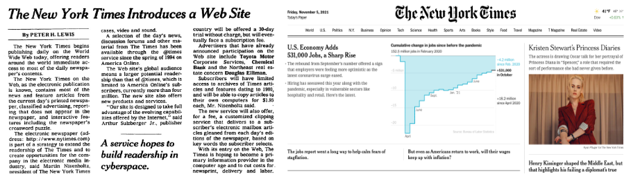
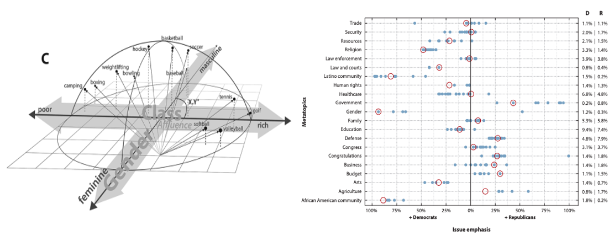

# Fundamental Concepts {#intro}

## Text as Data

Text is a seminal product of human interactions and social systems and has therefore been a longstanding data source within social science research. However, text data is often associated with qualitative scholarship given limitations of popular quantitative methods for handling words and language. While the numerical analysis of text has been of ongoing interest of fields such as linguistics and information sciences for decades, the employment of computational text analysis methods across a variety of academic disciplines has been a comparatively recent phenomenon. Said diffusion of the quantitative study of text is closely tied to the Digital Revolution’s concurrent facilitation of the *accessibility* of text data as well as *ability to model* said records within computationally-powered analyses. 

*Digital traces* or *footprints* refer to the records individuals leave behind of their behavior, thoughts, relationships, and beyond that is digitally recorded and often acquirable by third parties (Golder and Macy 2014). Text data is one of the most common types of digital trace data as facilitated by the rise of the internet, particularly regarding social media platform use. Consider the following trend as visualized by Our World in Data of just how ubiquitous social media has become globally- 

<iframe src="https://ourworldindata.org/grapher/users-by-social-media-platform?time=2004..2018&country=Facebook~Instagram~MySpace~Pinterest~Reddit~Snapchat~TikTok~Tumblr~Twitter~WeChat~Whatsapp~YouTube" loading="lazy" style="width: 100%; height: 600px; border: 0px none;"></iframe>

While some of these platforms focus more on images and video content over text, all of them have at least some degree of text produced that is often publicly accessible. Plenty of additional online platforms such as online marketplaces or business and government websites also produce large amounts of text that can be used within social science research. 

Beyond internet mediums, there is also the concurrent shift of preexisting print documents to digitized formats as well as the production of more recent documents to now be available online. Newspaper archives, government records, and books across languages are all examples of these sources. Researchers can now analyze historical documents through new methodological approaches through their digitized versions as well as connect published material across time from decades-old records to modern day. 

## Natural Language Processing

The rise of the internet and its ubiquitous cataloging of produced text occurred alongside the growth of resources and methods to computationally explore said written records. *Natural language processing*- shortened to NLP- is the field that specializes in using computational tools to interpret text. NLP itself refers to a broad range of applications including speech and handwriting recognition, text generation, translation, and a wide variety of additional use cases. NLP methods range in complexity from simple counts of word occurrences to the ability to generate accurately predicted words through machine learning-powered artificial intelligence. Recent advances in NLP have increasingly been able to engage with more complex questions regarding text, such as the context words occur in, their conceptual similarities to other words, and the potentially multiple meanings of a given word. 

It is often computationally resource intensive to store, process, and interpret text data. These barriers limited NLP's more widespread adoption within research across fields such as the social sciences, along with barriers regarding learning new programming languages and computational skills. Advances in the availability of computing resources have significantly sped up what may have otherwise be painfully slow algorithmic analyses and have made storage systems to save massive collections of text data widely available. The open-source software development movement has additionally lead to innovations in programming resources to use NLP that are free, methodologically rigorous, and often more accessibly designed to learn. 

## Computational Social Sciences

The subsequent adoption of NLP methods within social science research is a subset of the wider disciplinary establishment of the computational social sciences (CSS). Lazer et al. defines CSS as the “development and application of computational methods to complex, typically large-scale, human (sometimes simulated) behavioral data” (2009: 721). CSS spans a wide range of topics beyond text methods, with additional core areas including online community network analysis, geospatial tracking, agent-based modeling, and many more examples. However, CSS is particularly well-aligned with NLP methods when considering how much information on human behavior is embedded within text. A unique strength social scientists offer when conducting CSS research with NLP methods is their personal expertise towards interpreting often nuanced and contextualized findings within text data. Social scientists have therefore been on the cutting edge for conducting NLP-powered research across diverse topics and have formed related communities within universities and conferences connecting CSS and NLP practitioners. 

## NLP Core Vocabulary

This guide offers an introductory demonstration of how to apply NLP within your own research via R. Before moving to the chapter applications, we'll review a series of common terms within NLP used throughout the following chapters. I’ll ground said terminology by first reviewing the data set that all of the following chapters will build from that is available on the guide’s GitHub repository. 

Our data set is 100,000 comments scraped from [“r/nyc”](https://www.reddit.com/r/nyc/), which is the largest community on the social media site Reddit for posts and conversation around anything related to New York City. I obtained these records through a recent call to the [Pushshift](https://github.com/pushshift/api) Application Programming Interface (API) created by Jason Baumgartner. Reddit is known as the “Front Page of the Internet” and it is one of the most common social media sites studied within NLP research. Features of the platform that contribute to Reddit’s popularity within NLP is that its data is easily accessible, it features a range of sub-communities of potential interest, and it is a particularly text discussion-oriented platform. I'll also note that using Reddit data- as is the case with virtually all publicly accessible online trace data- comes with its own ethical considerations regarding privacy, sensitivity, and expectations around use within research. Please refer to the "Ethics" section in the final chapter of this guide for further thoughts around said topics.  

Now that we’ve familiarized ourselves with our data set, let’s consider how we would refer to its respective components through NLP terminology. 

1.	A **corpus** refers to the total collection of text being analyzed. This would be all 100k of our r/nyc Reddit comments. A **vocabulary** is the entire collection of unique words that occur within a given corpus. 

2.	A **document** is an individual record within the corpus. This is equivalent to one collected r/nyc comment and all of its associated text. 

    +	An example document would be “My favorite pizza place in Hell’s Kitchen is 99 Cent Fresh Pizza. I really love their BBQ Chicken Slice.”
    
3.	**Tokens** are the smaller composite units within a given document. “Token” on its own most commonly refers to individual words, but the actual process of tokenization can feature larger units such as sentences or paragraphs. 

    +	When referring to the tokens of the document example above, “My”, “favorite”, “pizza”, and “place” would be considered as four separate tokens of 21 total tokens including the sentence’s periods. However, another NLP method may instead operationalize this comment’s tokens as “My favorite pizza place in Hell’s Kitchen is 99 Cent Fresh Pizza.” and “I really love their BBQ Chicken Slice.” 
    
    +	Tokenization can also be conducted to character-level granularity, such as with “p”, “i”, “z”, “z”, “a”. 

4.	**N-grams** considers multiple word tokens at once where “n” refers to a specified number. They are often employed for representing words that are conceptually different when considered as a whole unit rather than as individual tokens.

    +	The bi-gram of “Hell’s_Kitchen” is understood as a specific neighborhood through each word’s co-occurrence with each other than what “Hell’s” or “Kitchen” would imply on their own. 

These are the core terms necessary for engaging with NLP methods and are often referred to directly within the R software packages we will be using in the following demos. With our core understanding of NLP and our data set now cemented, let’s move on to our first key step within our text analysis starting with text preprocessing in the next chapter. 

 

