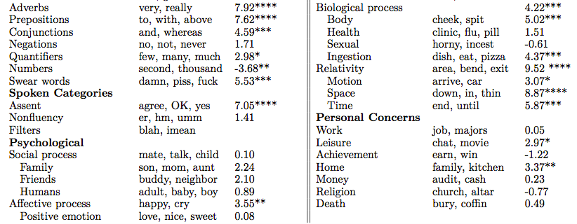
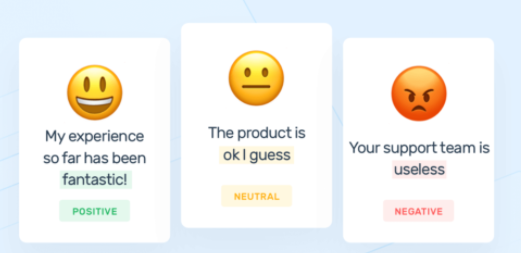

# Dictionaries & Sentiment Analysis {#dictionary}

Counting the prevalence and types of words used is a fundamental component of NLP that more complex methods often build from. Word counts offer plentiful information on what it being discussed within a given corpus, how common or rare said words are, who tends to use certain words, and how they differ in their use from other groups of interests. This chapter will provide both an overview of how word counts power the domain of dictionary-based NLP methods as well as walk through an application of counting words that fall into types of emotional sentiment within our r/nyc dataset. 

Baseline word counts often feature either the entire vocabulary or the counts for all words within a given document. Of particular interest for many social scientists is the prevalence of words within text as relevant to an abstract concept or theme. This is where lexical *dictionaries* shine, referring to any established collection of words used to measure a certain phenomenon that can be applied to various use cases. The measurement of said concept– while scaled and scored in different forms – is often based on initial word counts.

Dictionary-based methods use designated lexicons designed to accurately capture a variety of words that all measure the concept of interest. Some dictionary methods focus on general lexical features such as pronouns, grammar usage, or asked questions. Other dictionaries attempt to measure more abstract ideas such as identifying words that indicate power, politeness, toxicity, and beyond. For example, a politeness dictionary would have a predetermined list of relevant words such as “please” and “thanks” that is then implemented to measure the count of these words within a text dataset. Dictionaries require the user to predetermine the relationship between a word and a concept. They can be applied across domains to varying degrees depending on the words that comprise the dictionary, the rigor in which the dictionary was created, and the ideas it attempts to measure. 

## Types of Dictionaries

Dictionaries within text-based social science research are divided between those that are built by the researcher for their specific project, and those that were developed by other scholars and then shared for wider use. 

Building one’s own dictionary is particularly useful when conducting research relevant to specific communities with unique word usage patterns or when attempting to operationalize concepts with otherwise limited precedent within text methods. Robust dictionary design for specialized applications is a unique skill that many social scientists can offer, since we are often domain experts in niche social phenomenon and therefore have particular knowledge towards what words should be included. However, creating one’s own dictionary also has limitations, such as requiring more resources and labor to rigorously develop than sourcing already established dictionaries.

The challenges associated with developing one’s own dictionary is a sizable factor behind the popularity of using pre-established dictionaries within research. The creation of a large and conceptually rigorous dictionary is often a project that a whole team has spent considerable time on to identify candidate words from valid sources, cross-check term applicability through relevant agreement metrics, conduct experiments on the dictionary’s validity towards measuring its concept of interest, and finally review its potential applications across other research projects.  

One of the most famous dictionaries used within social science research is the Linguistic Inquiry Word Count (LIWC). LIWC includes over 70 categories across a variety of topics regarding both linguistic features and psychological metrics with a rigorous word validation process backing each dictionary. Its ability to measure complex phenomenon within text such as emotions, motivational drives, and cognitive processes has driven its use within a wide variety of projects across social science disciplines.

<center>



</center>

LIWC is a great resource that is both rigorously created and well established within the literature. However, it is a proprietary product which limits dictionary access both cost-wise and regarding keeping the individual words within each dictionary private. This can make it challenging to investigate how well said dictionaries will translate over to your specific text data.

Part of the beauty of NLP’s interdisciplinary growth is the availability of open-source dictionaries. There are a wide range of options, and I highly recommend conducting reviews on any specific topic you may be interested in exploring within your text data to see what dictionaries may align with your interests.

Much like with making your own dictionary, however, you’ll want to bear in mind the rigor and domain applicability of pre-made dictionaries. It’s often key to review whatever details are available regarding how the dictionary is made to understand its empirical robustness and relevance to your specific use case. This may be provided through resources such as publications that explain the process behind a dictionary’s creation or documentation within a dictionary’s repository or website when accessing its public files. 

## Sentiment Analysis

<center>



</center>

A NLP method that has been adopted across disciplines and is commonly based on established dictionaries is sentiment analysis. Most sentiment classification systems identify individual words as expressing positive, negative, or neutral sentiments and subsequently generates scores of the overall sentiment within a text. Sentiment analysis is often used to understand emotions around significant social events, consumer preferences, and political opinions. While a variety of computational methods can be employed to measure sentiment, one of the most common types of measurement tools are analyzers comprised of multiple dictionaries with words coded as expressing either of the three sentiments. 

There’s a range of dictionary-based sentiment analyzers that have been developed and tested on various sources such as tweets, online market product reviews, newspaper opinion sections, or movie reviews. This diversity of sentiment tools subsequently can differ in their dictionary terms and how they compute their sentiment scores. 

Intended sentiment within text is often highly contextual. Sentiment analysis methods therefore also differ in their consideration of intention within word usage. Intention with the negative sentiment of “cheap” referring to a bad product review takes a different tone when considering a “cheap” deal within an online marketplace. Applying a generic analysis tool in a context where a particular negative or positive phrase is used disproportionately often will likely produce inaccurate results. For example, “loss” as an often negatively categorized word within a sentiment dictionary would likely misrepresent many posts within a weight loss discussion forum. The influence of context is therefore essential to consider when choosing a sentiment dictionary for a specific research application. 

### VADER

The [Valence Aware Dictionary and Sentiment Reasoner](https://github.com/cjhutto/vaderSentiment)-  shortened to VADER- is the dictionary-based sentiment analyzer that we’ll be using in this demo. It was originally written in Python but is available in R through the VADER library. The analyzer’s sentiment dictionaries were created by a team of human raters that scored candidate words for both their emotional polarity (such as positive over negative) and intensity (“amazing” having a higher score than “okay”). VADER generates four scores when applied to text data- positive, negative, neutral, and a compound score that considers all three of these scores to provide an aggregate representation of a text’s overall sentiment. 

VADER is often the sentiment analyzer of choice for studies that use Reddit data since it is designed to account for common lexical features within social media text. VADER considers more complex influences towards intended sentiment when generating its scores such as negation with “I don’t like”, the underlying sentiment of emoticons and emojis, and the use of emphasis, capitalization, and punctuation. It is therefore a particularly well-suited tool for investigating our r/nyc dataset in the following demo. 

We’ll first load in our relevant dictionaries and dataset. You’ll want to reload the r/nyc data even if you’re following along from the previous text preprocessing chapter to ensure your text data is consistent with the demo as follows. Please install any new packages for your local computer as listed below via install.packages() as well. 

```{r, results=FALSE, message=FALSE}
library(readr)
library(dplyr)
library(stringr)
library(vader)
library(ggplot2)

nyc <- read_csv("nyc_reddit.csv")
```

### String Sentiment

Let’s consider examples of individual strings to hone our intuition regarding how VADER generates its sentiment scores. The get_vader() function is our tool of choice to produce individual string scores which I apply to three examples as follows. 

```{r}
get_vader("As someone who always depended on cars before, I LOVE the subway! <3")
get_vader("The subway is very helpful, but I'm not a fan of the rats.")
get_vader("I hate how delayed the subway always is… being late for work sucks. :(")
```

Each get_vader call generates both the individual scores of each word accounting for its polarity and valence, as well as the four overarching sentiment scores of each string. The first string is strongly positive and is shown to account for both the capitalization of “love” and the heart emoticon. The second string has both a positive connotation through “helpful” but also a negative tone with “not a fan”, leading to a weakly negative compound score. The final string is accurately identified as strongly negative and successfully captures the intention behind the sad face emoticon. 

Given our validation of VADER’s classification scheme to text very similar to our r/nyc comments, let’s go ahead and create a data frame of the VADER metrics of each of our comments through the vader_df() function. This can take some time to run given our dataset size and your computing resources. I’ve therefore included a “nyc_sentiment.csv” file of these scores pre-generated in the data file of the Github if you’d like to load in the sentiment scores directly instead. 

### r/nyc Sentiment

```{r, eval=FALSE}
nyc_sentiment <- vader_df(nyc$body)
nyc_sentiment
```

```{r, results=FALSE, message=FALSE}
## Alternatively
nyc_sentiment <- read_csv('nyc_sentiment.csv')
```

Now that we have generated scores for the entirety of our dataset, let’s investigate what the most high-compound scoring positive and negative posts are respectively. We’ll start on the positive side first through simple dplyr-powered data frame manipulation:

```{r, message=FALSE, warning = FALSE}
top_pos <- nyc_sentiment %>%
	top_n(5, compound)
top_pos$body
```
We can see through briefly reviewing the text that the most positive comments under VADER’s classification are speaking highly of particular NYC neighborhoods and restaurants or are expressing positive and friendly sentiment to other users within the subreddit. The first one likely received its high score due to its abudant use of "rich" as a positive term within VADER's dictionary. 

Let’s replicate this for the most negative comments. 

```{r, message=FALSE}
top_neg <- nyc_sentiment %>%
	top_n(-5, compound)
top_neg
```

I'll skip reading through the details of the most negative comments due to their often disturbing content, but skimming the text lines gives a rather clear picture towards the themes they're discussing. The fact that these are the most negatively associated comments reflects VADER's ability to catch the negative emotional valence of text related to violence and discrimination quite effectively. 


### Sentiment & Score

As a final exercise, we'll explore whether there’s a relationship between an r/NYC post’s community score and its expressed sentiment as identified by VADER. Comments can either be upvoted or downvoted by other users. This produces a score that serves as a proxy for the collective community reaction to a given comment. While most posts receive either no votes or a few upvotes, it can be interesting to see what types of posts lead to outlier cases of a highly positive or negative score in the context of a given subreddit. 

To prepare for this analysis, I’ll first have to join my separate data frames of both the baseline Reddit data and the VADER scores by comment. I then consider comments with a positive rating score of 20 or above or those that received a net negative score through ggplot2 scatterplots. 

```{r}
nyc_full <- merge(nyc, nyc_sentiment, by = "body")

ggplot(nyc_full[which(nyc_full$score>20),], aes(x=compound, y=score)) + geom_point()
ggplot(nyc_full[which(nyc_full$score<0),], aes(x=compound, y=score)) + geom_point()
```

It looks like there isn't a noticable relationship between post score and expressed sentiment for either the most upvoted scores or the most downvoted scores. This alludes to the importance of context and close reading of one's text data to understand the more abstract themes of what is embraced or contested within the r/nyc subreddit community beyond a simple approach of sentiment analysis through dictionary counts. 

## Beyond Dictionaries

This concludes our application of a dictionary-based sentiment analysis that can be easily replicated across other datasets to explore emotional polarity and intensity expressed within text. VADER is a particularly helpful tool for social media data, but other great sentiment analyzers avaliable in R are the multiple dictionaries included within [tidytext](https://www.tidytextmining.com/sentiment.html), [sentimentr]( https://github.com/trinker/sentimentr), and [SentimentAnalyis](https://cran.r-project.org/web/packages/SentimentAnalysis/vignettes/SentimentAnalysis.html). I highly recommend exploring each of the resources further to see how the differences between how they compute sentiment scores and the domains they’re designed to be particularly effective towards may align with your specific research interests. 

A major limitation of dictionaries is their restricted availability to incorporate words in context to each other. This has promoted alternative sentiment analysis techniques that use supervised machine learning methods to classify expressed sentiment and emotions with a greater attention to context and word co-occurrences. We’ll dig deeper into potential machine learning approaches in the next chapter of this guide by introducing the unsupervised method of topic modeling. 
