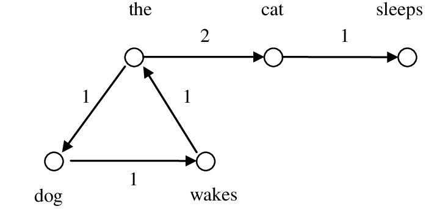

# Further Applications & Ethical Considerations {#methodsethics}

The previous chapters of this user guide offer applied introductions to NLP methods than can power your own research with text data. However, we’ve only scratched the surface of the range of potential NLP methods available to social scientists. I’ll therefore briefly introduce four more common NLP topics that I recommend further reading on via the provided reference section at the end of the user guide if any seem potentially well-aligned with your research interests.  

## Embeddings
Word embeddings are both a relevant individual approach for text-based research as well as a core text preprocessing specification that is combined with other methods. Word embeddings represent words in their lexical contexts by encoding each document as a vector of numbers. These vectors are produced through *dimensionality reduction* that collapses large vocabularies into a smaller numeric representation. Word embeddings are effective of capturing how words relate to each other through their similar or different contexts in text as inscribed in the *vector space* of each produced dimension within the vocabulary. The method is known for facilitating the accurate answering of word analogy test such as correctly identifying that “king - man + woman” equals “queen” within embedding-powered models. 

Embeddings can be incorporated within your text through a variety of training approaches and open-sourced resources such as [Word2Vec]( https://www.tensorflow.org/tutorials/text/word2vec) and [GloVe]( https://nlp.stanford.edu/projects/glove/). Although both models were originally designed for Python, they are available within R through the keras or text2vec packages for Word2Vec and GloVE respectively. Embeddings can come pre-trained as produced from often massive text data sets or can be locally trained to your specific corpus. Local training can be of particular interest to social scientists to see how your text data uniquely contextualizes words as related to each other. Locally trained embeddings have been successfully used in previous research to explore how social phenomenon such as bias and stereotypes, cognitive schemas, and inequality along race, class, and gender is captured within text. 
 
## Supervised Classification
While methods such as topic models explore previously unknown text relationships within datasets via unsupervised machine learning, supervised methods learn relationships through provided information on training data that can then be applied to new data without equivalent markers. They are commonly used to classify texts into relevant categories and draw from a wide range of algorithms from predictive logistic regression models familiar to social scientists to computationally complex neural networks that use deep learning. 

Supervised classification models can be very effective in identifying categorical aggregate trends within large text corpuses across domains. They also have specific design requirements that heavily define their suitability for different research projects. Supervised learning depends on previously identified *labeled* data, such as the relevant output categories of a sample of text which the model will learn to replicate its predictive design. Previous acquired labels can also be necessary for the independent variables of classifiers commonly known as *features*. Sometimes necessary labels for supervised models are readily available within your preestablished data, but oftentimes they are not particularly regarding complex themes within text that social scientists are interested in. The need to acquire labeled data is therefore a common expense and challenge associated with NLP supervised learning. Supervised learning algorithms can also be quite complicated to learn how to successfully implement, are often computationally expensive to fine-tune both regarding time and cost, and many are considered “black boxes” in their lack of transparency regarding how they actually learn to classify text data into groups. 

Despite these relevant limitations, supervised classification is still a strong NLP method that underlies recent achievements towards processing text data for use cases such as speech recognition, language translation, and text generation. It can be effectively used within social science research when its specific requirements are reasonably achievable for a given text-relevant research question. I highly recommend the tidymodels package which aggregates a variety of machine learning libraries in R into a consistent syntax for building supervised classifier models, as well as the [Supervised Machine Learning for Text Analysis in R](https://smltar.com/) guide by Emil Hvitfeldt and Julia Silge for step-by-step code walkthroughs of potential models. 

 
## Networks
Social network analysis refers to a broader social science subfield with preestablished theory and methods that can translate quite effectively to text data applications. Networks between text maps how language relates to each other within a wider corpus. Networks are commonly constructed via *nodes* that represent a unit within a network linked by *edges* that connect nodes as defined by their networked relationship to each other. Nodes within text-based networks can characterize individual words, documents, authors, or communities. Edges can therefore represent an equivalently wide variety of connections within text such as how words co-occur with each other within sentences, how documents have lexical similarities with other works, or how authors converse with each other within wider writing-based communities. 

Networks often serve as another exploratory method aligned with unsupervised machine learning in that they are both well-suited to capture latent themes and topical clusters within text. Network text analysis is particularly effective at highlighting relationship strength between text nodes, their similarities, differences, and changing connections over time. The use of graph-theory based visualizations displays network findings in a form that makes identifying subgroups and communities often quite intuitive. Additional analytic tools such as community detection algorithms that automate subgroup discovery and centrality measures to quantify how a given node connects to multiple communities within a network further strengthen network methods’ exploratory potential. Christian Bail’s [textnets](https://github.com/cbail/textnets/) package is my recommended resource to conduct text network analysis in R that streamlines all of the above network-theory applications into one framework. 

 
## Causality
The exploration of causal research questions within text data is an exciting methodological direction of likely interest to many social scientists that wish to move away from exclusively descriptive research results. Causality within text engages with two primary types of causal relationships- text as a treatment condition, and text as the outcome of a causal experiment. The first often considers how changing the words exposed to a treatment group compared to a control group leads to variations that can be therefore attributed to differences between the texts. The second instead focuses on how text itself can be used to measure how treatment levels produce divergent group outcomes.      

Causal approaches within text powered by NLP methods can bring new insights to longstanding text data sources within social science research such as open-ended questions in surveys. A major concern for designing rigorous causal studies is mitigating the impact of confounding factors that lead to a false interpretation of a causal relationship between treatment and outcome variables. While text has its own unique sources of confounding influences, scholars have defined methods to mitigate confounding factors often through document matching. 

Causal analysis of text data is less driven by specific R libraries or predictive algorithms as much as it by its overarching theory, necessary design requirements, and relevant modeling assumptions. Causal research therefore can be incorporated into the range of previous methods explored within this guide such as topic models and supervised classification. 

 
## Ethics of NLP

For all of the excitement around natural language processing both within academic research and as being incorporated into our everyday lives, there is equivalent apprehension regarding the ethics of NLP research and the ability for text-based systems to perpetuate harm and inequality. NLP research commonly employs either new or not widely known methods often on equivalently novel text-based domains such as with digital trace data from online platforms. Ethical best practices are therefore still being readily constructed and often include concerns that do not have simple solutions. 

Unfortunately, much of the ethical conversation around NLP-powered research has stem from incidents regarding NLP models that have already actively promoted bias and discrimination. Word embedding methods as highlighted earlier in this chapter are a particularly infamous source of said controversies, particularly referring to their tendency to perpetuate identity-based stereotypes such as towards gender and occupation or race and criminality. 

Given word embeddings’ eminent role in powering large-scale NLP applications such as search engines and recommendation systems, said biases have already been readily incorporated into NLP-based applications. However, the tendency for NLP models to learn bias has also been used within research to expose underlying inequities reflected within text data and the domains said data is sourced from. Bias in NLP is fundamentally a product of widespread social injustices that models learn through data’s inevitable representation of macro-level social phenomenon. These models are therefore capable of bringing attention to ethical issues within text along with their ability to subsequently perpetuate said problems.  

While models themselves can be developed through means that promote unethical outcomes and decisions, there are also more abstract concerns regarding the legitimacy of NLP analysis and text data around participant privacy, consent, and data autonomy. The widespread expansion of publicly available text data does not mean that the creators of said text actively consent to its use by third parties such as academic researchers. Cornell Tech Professor Helen Nissenbaum’s theory of contextual integrity delineates underlying norms regarding how individuals understand privacy towards what information is appropriate to share with various potential recipients that is often minimally considered within text data acquisition. Additionally, NLP applications such as causal methods can manipulate user behavior without their knowledge which may cross boundaries of consent that is commonly asked for when participants actively enroll in traditional experimental studies. 

The ambiguity around established ethical practices within NLP provides all the more incentive to proactively consider potential concerns and viable harm mitigation techniques for one’s specific research interests. Ethics within computational research is the specialty of the Fairness, Accountability, Transparency, and Ethics (FATE) community within computer and information sciences, while a variety of computational social scientists have also been tackling ethical dilemmas in relevant disciplinary journals. These can serve as essential resources for building an informed ethics protocol well-suited for the unique complexities of each research project. 

## Future Directions

NLP is a powerful methodological domain that draws from computer science, linguistics, and information sciences to analyze digitized texts for a massive variety of potential use cases. NLP’s more widespread adoption as an available tool within research has been limited by it being a novel method for many social scientists that draws heavily from often unfamiliar frameworks within computer science. However, NLP methods are only growing in their ability to accurately represent complex social phenomenon found within text while the means to use these new approaches have become more publicly accessible to implement.  

I hope the chapters of this guide have served their purpose towards inspiring your own potential NLP-powered research as well as demonstrated just how achievable implementing said methods are through R. Part of the beauty of R being open-source is that developers are constantly creating new packages and improve upon preexisting libraries. Given NLP’s continuous growth in new approaches and methods, I encourage interested practitioners to always keep an eye out for new tools for NLP in R that may be of specific interest to your research. The greater application of NLP across academic disciplines such as the social sciences will lead to new discoveries and further refinement that will continue to expand this already robust methodological field. My hope is that this guide has served as a source of inspiration and will potentially aid further fantastic research in the Cornell social science community using natural language processing. 
