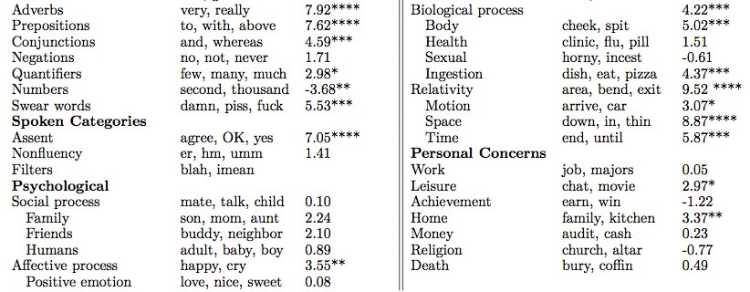

# Preface {-}
--- 
title: "Natural Language Processing for the Social Sciences"
author: "Remy Stewart"
date: "`r Sys.Date()`"
site: bookdown::bookdown_site
output: bookdown::gitbook
documentclass: book
bibliography: [book.bib, packages.bib]
biblio-style: abbrv
link-citations: yes
github-repo: ccss-rs/nlp-for-socsci
url: 'http\://ccss-rs/nlp-for-socsci'
description: "Natural Language Processing for the Social Sciences User Guide."
---

Welcome to the Natural Language Processing for Social Sciences User Guide provided by the Cornell Center for Social Sciences (CCSS). This guide serves as both the written version of the Spring 2022 workshop under the same name as well as a standing reference available to the wider Cornell community. You'll find the guide's [associated repository](https://github.com/ccss-rs/nlp-for-socsci) here on the CCSS Github page as well.  

Are you… 

*	Not too familiar with NLP and are looking for a broad view on the discipline as applicable to social science research?
*	Curious to learn about how you could incorporate NLP into your research?
*	Know enough R to understand its basic syntax?
*	In search of simple and interpretable R code to get you started on using NLP?

If any of these are true for you, I think you’ll be able to get something out of this guide.

This guide is heavily inspired by a [whole](https://cfss.uchicago.edu/) [series](https://cbail.github.io/ids704/Home.html) [of](https://www.tidytextmining.com/index.html) [similar](https://slcladal.github.io/index.html) [works](https://m-clark.github.io/text-analysis-with-R/) [designed](https://melaniewalsh.github.io/Intro-Cultural-Analytics/welcome.html) to introduce NLP methods. Almost all of these resources go further into depth on the topics introduced within this guide and I highly recommend them all as additional references. 

A little about the author- my name is Remy Stewart, and I am both a PhD Candidate in the Sociology Department here at Cornell as well as a Data Science Consultant for CCSS. I use NLP extensively within my own research that investigates how technology impacts public policy and perpetuates inequality within US urban regions. This work therefore unavoidably reflects my own disciplinary training biases, but I intentionally designed it to be as widely applicable to readers across social science fields as possible. 

You’ll be able to navigate through the individual chapters of the guide through the index to the left. The chapters do build from each other, but can stand alone for each topic as well. 

```{r include=FALSE}
# automatically create a bib database for R packages
knitr::write_bib(c(
  .packages(), 'bookdown', 'knitr', 'rmarkdown'
), 'packages.bib')
```

<!--chapter:end:index.Rmd-->

# Fundamental Concepts {#intro}

## Text as Data

Text is a seminal product of human interactions and social systems and has therefore been a longstanding data source within social science research. However, text data is often associated with qualitative scholarship given limitations of popular quantitative methods for handling words and language. While the numerical analysis of text has been of ongoing interest of fields such as linguistics and information sciences for decades, the employment of computational text analysis methods across a variety of academic disciplines has been a comparatively recent phenomenon. Said diffusion of the quantitative study of text is closely tied to the Digital Revolution’s concurrent facilitation of the *accessibility* of text data as well as *ability to model* said records within computationally-powered analyses. 

*Digital traces* or *footprints* refer to the records individuals leave behind of their behavior, thoughts, relationships, and beyond that is digitally recorded and often acquirable by third parties (Golder and Macy 2014). Text data is one of the most common types of digital trace data as facilitated by the rise of the internet, particularly regarding social media platform use. Consider the following trend as visualized by Our World in Data of just how ubiquitous social media has become globally- 

<iframe src="https://ourworldindata.org/grapher/users-by-social-media-platform?time=2004..2018&country=Facebook~Instagram~MySpace~Pinterest~Reddit~Snapchat~TikTok~Tumblr~Twitter~WeChat~Whatsapp~YouTube" loading="lazy" style="width: 100%; height: 600px; border: 0px none;"></iframe>

While some of these platforms focus more on images and video content over text, all of them have at least some degree of text produced that is often publicly accessible. Plenty of additional online platforms such as online marketplaces or business and government websites also produce large amounts of text that can be used within social science research. 

Beyond internet mediums, there is also the concurrent shift of preexisting print documents to digitized formats as well as the production of more recent documents to now be available online. Newspaper archives, government records, and books across languages are all examples of these sources. Researchers can now analyze historical documents through new methodological approaches through their digitized versions as well as connect published material across time from decades-old records to modern day. 

<center>


</center>

## Natural Language Processing

The rise of the internet and its ubiquitous cataloging of produced text occurred alongside the growth of resources and methods to computationally explore said written records. *Natural language processing*- shortened to NLP- is the field that specializes in using computational tools to interpret text. NLP itself refers to a broad range of applications including speech and handwriting recognition, text generation, translation, and a wide variety of additional use cases. NLP methods range in complexity from simple counts of word occurrences to the ability to generate accurately predicted words through machine learning-powered artificial intelligence. Recent advances in NLP have increasingly been able to engage with more complex questions regarding text, such as the context words occur in, their conceptual similarities to other words, and the potentially multiple meanings of a given word. 

It is often computationally resource intensive to store, process, and interpret text data. These barriers limited NLP's more widespread adoption within research across fields such as the social sciences, along with barriers regarding learning new programming languages and computational skills. Advances in the availability of computing resources have significantly sped up what may have otherwise be painfully slow algorithmic analyses and have made storage systems to save massive collections of text data widely available. The open-source software development movement has additionally lead to innovations in programming resources to employ NLP that are free, methodologically rigorous, and often more accessibly designed to learn. 

## Computational Social Sciences

The subsequent adoption of NLP methods within social science research is a subset of the wider disciplinary establishment of the computational social sciences (CSS). Lazer et al. defines CSS as the “development and application of computational methods to complex, typically large-scale, human (sometimes simulated) behavioral data” (2009: 721). CSS spans a wide range of topics beyond text methods, with additional core areas including online community network analysis, geospatial tracking, agent-based modeling, and many more examples. However, CSS is particularly well-aligned with NLP methods when considering how much information on human behavior is embedded within text. A strength social scientists offer when conducting CSS research with NLP methods is their personal expertise towards interpreting often nuanced and contextualized findings within text data. Social scientists have therefore been on the cutting edge for conducting NLP-powered research across diverse topics and have formed related communities within universities and conferences connecting CSS and NLP practitioners. 

<center>


</center>

## NLP Core Vocabulary

This guide offers an introductory demonstration of how to apply NLP within your own research via R. Before moving to the chapter applications, we'll review a series of core common terms within NLP used throughout the chapters. I’ll ground said terminology by first reviewing the data set that all of the following chapters will build from that is available on the guide’s GitHub repository. 

Our data set is 100,000 comments scraped from [“r/nyc”](https://www.reddit.com/r/nyc/), which is the largest community on the social media site Reddit for posts and conversation around anything related to New York City. I obtained these records through a recent call to the [Pushshift](https://github.com/pushshift/api) Application Programming Interface (API) created by Jason Baumgartner. Reddit is known as the “Front Page of the Internet” and it is one of the most common social media sites studied within NLP research. Features of the platform that contribute to Reddit’s popularity within NLP is that its data is easy accessed, it features a range of sub-communities of potential interest, and it is a text discussion-oriented platform. I'll also note that using Reddit data- as is the case with virtually all publicly accessible online trace data- comes with its own ethical considerations regarding privacy, sensitivity, and expectations around use within research. Please refer to the "Ethics" section in the final chapter of this guide for further thoughts around said topics.  

<center>


</center>

Now that we’ve familiarized ourselves with our data set, let’s consider how we would refer to its respective components through NLP terminology. 

1.	A **corpus** refers to the total collection of text being analyzed. This would be all 100k of our r/nyc Reddit comments. A **vocabulary** is the entire collection of unique words that occur within a given corpus. 

2.	A **document** is an individual record within the corpus. This is equivalent to one collected r/nyc comment and all of its associated text. 

    +	An example document would be “My favorite pizza place in Hell’s Kitchen is 99 Cent Fresh Pizza. I really love their BBQ Chicken Slice.”
    
3.	**Tokens** are the smaller composite units within a given document. “Token” on its own most commonly refers to individual words, but the actual process of tokenization can feature larger units such as sentences or paragraphs. 

    +	When referring to the tokens of the document example above, “My”, “favorite”, “pizza”, and “place” would be considered as four separate tokens of 21 total tokens including the sentence’s periods. However, another NLP method may instead operationalize this comment’s tokens as “My favorite pizza place in Hell’s Kitchen is 99 Cent Fresh Pizza.” and “I really love their BBQ Chicken Slice.” 
    
    +	Tokenization can also be conducted to character-level granularity, such as with “p”, “i”, “z”, “z”, “a”. 

4.	**N-grams** considers multiple word tokens at once where “n” refers to a specified number. They are often employed for representing words that are conceptually different when considered as a whole unit rather than as individual tokens.

    +	The bi-gram of “Hell’s_Kitchen” is understood as a specific neighborhood through each word’s co-occurrence with each other than what “Hell’s” or “Kitchen” would imply on their own. 


These are the necessary terms to know when engaging with NLP methods and are often referred to directly within the R software packages we will be using in the following demos. With our core understanding of NLP and our data set now cemented, let’s move on to our first key step within our text analysis starting with text preprocessing in the next chapter. 

 


<!--chapter:end:01-intro.Rmd-->

# Text Pre-processing {#textproc}

Preparing text data for NLP analysis presents unique challenges. Text can vary significantly in its degree of raw “messiness” compared to other common data types depending on where it was sourced from, what types of information the text commonly expresses, and what unwanted components within the text may be present. 

*Text pre-processing* refers to a variety of techniques used to prepare text data into a form ready for analysis. Applicable pre-processing steps are therefore highly dependent on both the data set and your intended NLP methods. Some pre-processing strategies are for specific use cases, while there’s a general set of recurring techniques often required for NLP applications. 

NLP research findings are often heavily influenced by previous choices made within the research workflow, and text pre-processing decisions are one of the biggest contributors to this variability. How you decide to prepare text data can lead to significant variations in results further within your research. I will therefore provide an overview of a wide range of pre-processing options and encourage you to test out a variety of these for your specific use cases. This is key to ensure the robustness of your findings to various text specifications and will strengthen the rigor of your research overall. 

This demo focuses on four of my go-to R packages for NLP research that all stem from the *tidyverse* collection by Hadley Wickham and the team at R Studio. These packages are designed to be simple to implement and to build from each other for various tasks relevant to data preparation. **readr** facilitates the easy uploading of external data files such as CSVs into R while **dplyr** promotes streamlined data frame creation and manipulation from said files. **stringr** is all about working with character strings which is the data type that text falls under. **tidytext** provides more specialized functions to prepare text data for various NLP use cases.

I’ll go ahead and load all of these packages into our working session under the assumption that you've installed them into your local machine through the install.packages() command. I'll also read in our r/nyc data set from the provided CSV file sourced from this guide's [Github repository](https://github.com/ccss-rs/nlp-for-socsci). I recommend that you create a folder on your computer that holds both the CSV data and a saved R file titled “text_preprocessing.R” in one location.
  
```{r, results=FALSE, message=FALSE}
library(readr)
library(dplyr)
library(stringr)
library(tidytext)

nyc <- read_csv("nyc_reddit_data.csv")
```

## Character Encoding

*Character encoding* refers to numerical codes designed for programs to know how to display a text character. Particularly messy text sources such as website scrapes can lead to data sets that follow different types of character encoding schemas. This can create issues for reading in and manipulating text within a given program and/or method. Most English text data is used with either Unicode/UTF-8 or ASCII encoding, and we can check if our data set of r/nyc comments follows one of these encoding schemas after loading in our data. 

```{r}
guess_encoding(nyc$body)
```
Our 1 confidence score on the UTF-8 encoding for the text column of our data frame gives us assurance that the following pre-processing methods should work without issues around character encoding. Let’s now inspect our data set in more detail. 

```{r}
nyc 
```

This provides us with the first 10 records of our data set. “id” is the unique identifier for each individual comment, “body” features the text of the comment itself, and “score” refers to the Reddit system of being able to “upvote” or “downvote” comments similar to a like/dislike framework. Our pre-processing will focus on “body” as the main text feature of our data. 

##  String Cleaning

String manipulation is key to virtually any form of text data cleaning to remove unwanted noise within text and represent a given document in a more interpretable form. This is where functions in the stringr package particularly shine. 

Let’s first consider one semantically meaningless token found throughout our data set- “`\n`”. This represents line breaks within HTML web syntax that were captured as a by-product of scraping our Reddit comments. We can use stringr’s str_remove_all function to strip out all instances of `\n` directly from the comment text. 

```{r}
nyc$body <- str_remove_all(nyc$body, "\n")
```

This successfully removes all instances of “`\n`”. There are a variety of additional components of text data that a user may want to remove depending on their intended NLP use case. For example, deleting all punctuation is commonly desired within NLP methods since punctuation may be otherwise be tokenized as their own words. Our previous method is great at removing any exact match with “`\n`” within the comments, but a more streamlined technique to remove any undesired character type would save us much more time and code lines then individually having to identify every type of punctuation we'd like to remove.

## Regular Expressions

*Regular expressions*- commonly shorted to regexes- is a core tool within string manipulation to perform more complex text removal commands. Regexes allow you to identify patterns within text and perform selected operations on them. Regex design can get quite complicated and successfully constructing a regex for specific use cases is another topic in itself. They also must be handled with care, as they can easily end up editing your text data into a form you weren’t originally intending to occur. Regexes are however a highly flexible tool for solving advanced problems within text manipulation.

Given that the remaining noise in our r/nyc comments features a wide variety of punctuation characters types, a regex that identifies and removes all punctuation will serve our purposes particularly well. The special regex we’ll use is [:punct:] which successfully identifies all punctuation characters. Removing said punctuation is achieved through another call with str_remove_all as follows:

```{r}
nyc$body <- str_remove_all(nyc$body, '[:punct:]')
```

## Lowercasing & Concatenation

It’s common within text pre-processing to convert all words to lowercase since capitalization may lead a given NLP method to consider the same words as separate entities based on casing alone. You may also consider explicitly combining n-grams into single word units, such as concatenating all instances of the bi-gram “New York” into the single token of “New_York”. This isn’t as commonly used within NLP as lowercasing is, but there’s certain use cases where having n-grams connected with each other can be key to your research interests. The stringr-based techniques for lowercasing and concatenating are respectively as follows:

```{r}
nyc$body <- str_to_lower(nyc$body)
nyc$body <- str_replace_all(nyc$body, "New York", "New_York")
```

## Tokenization

*Tokenization* as mentioned in this guide’s first chapter refers to the segmentation of text components into units such as individual words, sentences, paragraphs, characters, or n-grams. While the best type of tokenization to use is highly dependent on your research questions and planned analyses, the most common tokenization units overall are individual words. I therefore employ tidytext’s unnest_tokens method to create a separate data frame with a designated row for each individual word within a r/nyc comment. The “word” argument specifies individual words as our tokenization unit. 

```{r}
tokens <- nyc %>%
    unnest_tokens("word", body)
```

Our 100,000 original comments are now almost 3.5 million rows of individual word tokens. By default, unnest_tokens lowercases the tokens and removes punctuation from the original string. This allows you to skip stringr’s to_lower and having to use a punctuation removal regex if you’re also planning on tokenizing your text data through tidytext. 

## Optional Method-Dependent Pre-processing Steps 

There’s a variety of additional pre-processing techniques you may consider for your specific NLP research interests beyond the previously specified methods. These include stopword removal, stemming, and parts-of-speech tagging. These techniques are overall more case-by-case in their usefulness than string manipulation and tokenization are as core pre-processing steps. Even methods where techniques such as stopword removal or lemmatization are common, there is ongoing debates within the NLP community regarding whether said methods are helpful or appropriate. However, certain methods can be significantly aided by the right use of these pre-processing steps. It’s often best to see if your results change either with or without a given pre-processing technique, and if they do consider said differences in the interpretation of your overall research findings. 

### Stopwords

*Stopwords* is the term for common words such as “the”, “but”, and “is” that are often understood as contextually irrelevant for the purposes of a given NLP analysis. Stopword removal is particularly helpful for when you’d like to focus on unique and/or subject-specific words that often carry more in-depth meaning than more common phrases. Topic models are one NLP method we’ll be exploring later in this guide where stopword removal is quite common, as the model is primarily used to discover conceptually deeper themes within text than what semantically generic words indicate. However, other use cases such as exploring how two communities differ in conversational styles may be better served by keeping stop words, since even common words can allude to meaningful differences between groups. 

If stopword removal seems relevant to your given research question, tidytext actually provides an established data set of common English stopwords for you to remove from your tokenized text. This is achieved through an *anti-join* of your own data and the stopwords data frame, which builds from query-language data merging principles to not include words that match both data sets. It’s also important to note that this pre-specified set of stopwords may not entirely translate to other common and conceptually less meaningful words within your own data. It’s therefore common to add terms to an initial list and perform additional stopword removal through techniques such as the previously delineated str_remove_all. 

```{r, results=FALSE, message=FALSE}
data(stop_words)

tokens <- tokens %>%
  anti_join(stop_words)
```

### Stemming

*Stemming* refers to reducing words to their base forms. This technique is often used to group together different words that have the same underlying root such as “swims”, “swimmer”, and “swimming” all referring to the base stem of “swim”. Stemming can be helpful to streamline vocabulary size, such as for machine learning NLP techniques where having less words that are similar to each other can cut down on processing time and resources for running already complex models. However, similar words via a core base root can also have different conceptual meanings or are used in distinct contexts from each other within text that stemming may minimize or lead to a misinterpretation of. There’s a variety of different stemming algorithms available with the most commonly used being the Porter stemmer. You’ll have to download the SnowballC package separately to use the Porter stemming technique. I demonstrate its application on our previously created tidytext word token data frame below:

```{r}
library(SnowballC)

stems <- tokens %>%
  mutate(stem = wordStem(word)) %>%
  count(stem, sort = TRUE)
```

### Parts-of-Speech

Part-of-speech (POS) tagging describes the process of identifying the lexical and grammatical category a word belongs to within a sentence, such as nouns, adverbs, conjunctions, and beyond. POS tags are often used for analyses where the type of words within text is of particular importance to your research interests. Potential cases of this include how actors interact with each other as expressed in a given sentence’s structure or how the frequency of certain linguistic features within text may be predictive of an outcome. Annotating each token’s respective POS type can be used to generate counts of overall categories or discover the most common words that fall into a given lexical class within your text. 

One disadvantage of POS tagging is that it can take a long time to process an entire tokenized corpus with each word’s matching POS class. Different libraries that support POS tagging often require you to download and load a separate annotation model that maps words to their correct POS categories as well. The udpipe package streamlines this process with its concurrent library commands delineated in the following code for our tokenized r/nyc comments below:

```{r, eval=FALSE}
library("udpipe")

model <- udpipe_download_model(language = "english")
model <- udpipe_load_model(model)

## Annotation will take quite some time, particularly if you're using the 
## non-stopword version of our tokenized dataset 
tags <- udpipe_annotate(model, x = tokens$word)

## The generated "upos" column in the following dataframe will have each token's 
## identified POS tags.
pos <- as.data.frame(tags)
```

<!--chapter:end:02-textproc.Rmd-->

# Dictionaries & Sentiment Analysis {#dictionary}

Counting the prevalence and types of words used within text is a fundamental component of NLP that more complex methods often build from. Word counts offer plentiful information on what it being discussed within a given corpus, how common or rare said words are, who tends to use certain words, and how they differ in their use from other groups of interests. This chapter will provide both an overview of how word counts power the domain of dictionary-based NLP methods as well as walk through an application of counting words that fall into types of emotional sentiment within our r/nyc dataset. 

Baseline word counts often feature either the entire vocabulary or the counts for all words within a given document. Of particular interest for many social scientists is the prevalence of words within text as relevant to an abstract concept or theme. This is where lexical *dictionaries* shine, referring to an established collection of words used to measure a certain phenomenon that can be applied to various NLP use cases. The measurement of said concept– while scaled and scored in different forms – is often based on initial word counts.

Dictionary-based methods use designated lexicons designed to accurately capture a variety of words that all measure the concept of interest. Some dictionary methods focus on general lexical features such as pronouns, grammar usage, or asked questions. Other dictionaries attempt to measure more abstract ideas such as identifying words that indicate power, politeness, toxicity, and beyond. For example, a politeness dictionary would have a predetermined list of relevant words such as “please” and “thanks” that is then implemented to measure the count of these words within a text dataset. Dictionaries require the user to predetermine the relationship between a word and a concept. They can be applied across domains to varying degrees depending on the words that comprise the dictionary, the rigor in which the dictionary was created, and the ideas it attempts to measure. 

## Types of Dictionaries

Dictionaries within text-based social science research are divided between those that are built by the researcher for their specific project, and those that were developed by other scholars and then shared for wider use. 

Building one’s own dictionary is particularly useful when conducting research relevant to specific communities with unique word usage patterns or when attempting to operationalize concepts with otherwise limited precedent within text methods. Robust dictionary design for specialized applications is a unique skill that many social scientists can offer, since we are often domain experts in niche social phenomenon and therefore have particular knowledge towards what words should be included. However, creating one’s own dictionary also has limitations, such as requiring more resources and labor to rigorously develop than sourcing previously developed dictionaries.

The challenges associated with creating one’s own dictionary is a sizable factor behind the popularity of using pre-established dictionaries within research. The creation of a large and conceptually rigorous dictionary is often a project that a whole team has spent considerable time on to identify candidate words from valid sources, cross-check term applicability through relevant agreement metrics, conduct experiments on the dictionary’s validity towards measuring its concept of interest, and finally review its potential applications across other research projects.  

One of the most famous dictionaries used within social science research is the Linguistic Inquiry Word Count (LIWC). LIWC includes over 70 categories across a variety of topics regarding both linguistic features and psychological metrics with a rigorous word validation process backing each dictionary. Its ability to measure complex phenomenon within text such as emotions, motivational drives, and cognitive processes has driven its use within a wide variety of projects across social science disciplines.

<center>



</center>

LIWC is a great resource that is both rigorously created and well established within the literature. However, it is a proprietary product which limits dictionary access both cost-wise and regarding keeping the individual words within each dictionary private. This can make it challenging to investigate how well said dictionaries will translate over to your specific text data.

Part of the beauty of NLP’s interdisciplinary growth is the availability of open-source dictionaries. There are a wide range of options, and I highly recommend conducting reviews on any specific topic you may be interested in exploring within your text data to see what dictionaries may align with your interests.

Much like with making your own dictionary, however, you’ll want to bear in mind the rigor and domain applicability of pre-made dictionaries. It’s often key to review whatever details are available regarding how the dictionary is made to understand its empirical robustness and relevance to your specific use case. This may be provided through resources such as publications that explain the process behind a dictionary’s creation or documentation within a dictionary’s repository or website when accessing its public files. 

## Sentiment Analysis

<center>


</center>

A NLP method that has been adopted across disciplines and is commonly based on established dictionaries is sentiment analysis. Most sentiment classification systems identify individual words as expressing positive, negative, or neutral sentiments and subsequently generates scores of the overall sentiment within a text. Sentiment analysis is often used to understand emotions around significant social events, consumer preferences, and political opinions. While a variety of computational methods can be employed to measure sentiment, one of the most common types of measurement tools are analyzers comprised of multiple dictionaries with words coded as expressing either of the three sentiments. 

There’s a range of dictionary-based sentiment analyzers that have been developed and tested on various sources such as tweets, online market product reviews, newspaper opinion sections, or movie reviews. This diversity of sentiment tools subsequently can differ in their dictionary terms and how they compute their sentiment scores. 

Intended sentiment within text is often highly contextual. Sentiment analysis methods therefore also differ in their consideration of intention within word usage. Intention with the negative sentiment of “cheap” referring to a bad product review takes a different tone when considering a “cheap” deal within an online marketplace. Applying a generic analysis tool in a context where a particular negative or positive phrase is used disproportionately will likely produce inaccurate results. For example, “loss” as an often negatively categorized word within a sentiment dictionary would likely misrepresent many posts within a weight loss discussion forum. The influence of context is therefore essential to consider when choosing a sentiment dictionary for a specific research application. 

### VADER

The [Valence Aware Dictionary and Sentiment Reasoner](https://github.com/cjhutto/vaderSentiment)-  shortened to VADER- is the dictionary-based sentiment analyzer that we’ll be using in this demo. It was originally written in Python but is available in R through the VADER library. The analyzer’s sentiment dictionaries were created by a team of human raters that scored candidate words for both their emotional polarity (such as positive over negative) and intensity (“amazing” having a higher score than “okay”). VADER generates four scores when applied to text data- positive, negative, neutral, and a compound score that considers all three of these scores to provide an aggregate representation of a text’s overall sentiment. 

VADER is often the sentiment analyzer of choice for studies that use Reddit data since it is designed to account for common lexical features within social media text. VADER considers more complex influences towards intended sentiment when generating its scores, such as negation with “I don’t like”, the underlying sentiment of emoticons and emojis, and the use of emphasis, capitalization, and punctuation. It is therefore a particularly well-suited tool for investigating our r/nyc dataset in the following demo. 

We’ll first load in our relevant dictionaries and dataset. You’ll want to reload the r/nyc data even if you’re following along from the previous text preprocessing chapter to ensure your text data is consistent with the demo as follows. Please install any new packages for your local computer as listed below via install.packages() as well. 

```{r, results=FALSE, message=FALSE}
library(readr)
library(dplyr)
library(stringr)
library(vader)
library(ggplot2)

nyc <- read_csv("nyc_reddit_data.csv")
```

### String Sentiment

Let’s consider examples of individual strings to hone our intuition regarding how VADER generates its sentiment scores. The get_vader() function is our tool of choice to produce individual string scores which I apply to three examples as follows. 

```{r}
get_vader("As someone who always depended on cars before, I LOVE the subway! <3")
get_vader("The subway is very helpful, but I'm not a fan of the rats.")
get_vader("I hate how delayed the subway always is… being late for work sucks. :(")
```

Each get_vader call generates both the individual scores of each word accounting for its polarity and valence, as well as the four overarching sentiment scores of each string. The first string is strongly positive and is shown to account for both the capitalization of “love” and the heart emoticon. The second string has both a positive connotation through “helpful” but also a negative tone with “not a fan”, leading to a weakly negative compound score. The final string is accurately identified as strongly negative and successfully captures the intention behind the sad face emoticon. 

Given our validation of VADER’s classification scheme to text very similar to our r/nyc comments, let’s go ahead and create a data frame of the VADER metrics of each of our comments through the vader_df() function. This can take some time to run given our dataset size and your computing resources. I’ve therefore included a “nyc_sentiment.csv” file of these scores pre-generated in the data file of the [Github](https://github.com/ccss-rs/nlp-for-socsci) if you’d like to load in the sentiment scores directly instead. 

### r/nyc Sentiment

```{r, eval=FALSE}
nyc_sentiment <- vader_df(nyc$body)
nyc_sentiment
```

```{r, results=FALSE, message=FALSE}
## Alternatively
nyc_sentiment <- read_csv('nyc_sentiment.csv')
```

Now that we have generated scores for the entirety of our dataset, let’s investigate what the most high-compound scoring positive and negative posts are respectively. We’ll start on the positive side first through simple dplyr-powered data frame manipulation:

```{r, message=FALSE, warning = FALSE}
top_pos <- nyc_sentiment %>%
	top_n(5, compound)
top_pos$body
```
We can see through briefly reviewing the text that the most positive comments under VADER’s classification are speaking highly of particular NYC neighborhoods and restaurants or are expressing friendly comments to other users within the subreddit. The first one likely received its high score due to its abundant use of "rich" as a positive term within VADER's dictionary. 

Let’s replicate this for the most negative comments. 

```{r, message=FALSE}
top_neg <- nyc_sentiment %>%
	top_n(-5, compound)
top_neg
```

I'd recommend skipping the details of the most negative comments due to their often disturbing content, but skimming the text lines gives a rather clear picture towards the themes they're discussing. The fact that these are the most negatively associated comments reflects VADER's ability to catch the negative emotional valence of text related to violence and discrimination quite effectively. 


### Sentiment & Score

As a final exercise, we'll explore whether there’s a relationship between an r/NYC post’s community score and its expressed sentiment as identified by VADER. Comments can either be upvoted or downvoted by other users. This produces a score that serves as a proxy for the collective community reaction to a given comment. While most posts receive either no votes or a few upvotes, it can be interesting to see what types of posts lead to outlier cases of a highly positive or negative score in the context of a given subreddit. 

To prepare for this analysis, I’ll first have to join my separate data frames of both the baseline Reddit data and the VADER scores by comment. I then consider comments with a positive rating score of 20 or above or those that received a net negative score through ggplot2 scatterplots. 

```{r}
nyc_full <- merge(nyc, nyc_sentiment, by = "body")

ggplot(nyc_full[which(nyc_full$score>20),], aes(x=compound, y=score)) + geom_point()
ggplot(nyc_full[which(nyc_full$score<0),], aes(x=compound, y=score)) + geom_point()
```

It looks like there isn't a noticeable relationship between post score and expressed sentiment for either the most upvoted scores or the most downvoted scores. This alludes to the importance of context and close reading of one's text data to understand the more abstract themes of what is embraced or contested within the r/nyc subreddit community beyond a simple approach of sentiment analysis through dictionary counts. 

## Beyond Dictionaries

This concludes our application of a dictionary-based sentiment analysis that can be easily replicated across other datasets to explore emotional polarity and intensity expressed within text. VADER is a particularly helpful tool for social media data, but other great sentiment analyzers available in R are the multiple dictionaries included within [tidytext](https://www.tidytextmining.com/sentiment.html), [sentimentr]( https://github.com/trinker/sentimentr), and [SentimentAnalyis](https://cran.r-project.org/web/packages/SentimentAnalysis/vignettes/SentimentAnalysis.html). I highly recommend exploring each of the resources further to see how they differ in their approaches to computing sentiment scores and how the domains they’re designed to be particularly effective towards may align with your  research interests. 

A major limitation of dictionaries is their restricted ability to incorporate words in context to each other. This has promoted alternative sentiment analysis techniques that use supervised machine learning methods to classify expressed sentiment and emotions with a greater attention to context and word co-occurrences. We’ll dig deeper into potential machine learning approaches in the next chapter of this guide by introducing the unsupervised method of topic modeling. 

<!--chapter:end:03-dictionary.Rmd-->

# Machine Learning & Topic Models {#ml}

*Machine learning* (ML) has been rapidly increasing in popularity within academia as data science and computational approaches have become more widely known across disciplines. The term can be intimidating for those unfamiliar with its theory and methods. A simplified conceptualization of machine learning is the application of algorithms- a set of instructions grounded in foundational math and statistics- to identify relationships within data to produce informed predictions on. The "learning" in machine learning refers to these method’s ability to perform additional steps within its analysis building from directly programmed instructions via the relationships it is able to learn within your data set. These methods therefore excel at categorization, pattern recognition, and identifying large-scale trends through how each model learns the data it is trained on. 

## Supervised vs. Unsupervised Learning

Machine learning methods are often differentiated between supervised and unsupervised approaches. Supervised methods are based on labeled data sets where a model learns a relationship to produce a predicted outcome value. "Labeled" data refers to data that has identified features and characteristics that are directly provided to the ML model. Said specified features must be identified ahead of time to use supervised learning methods as the model uses these previously delineated examples to become "trained" in predicting an outcome of interest towards data with similar features. The developed model is then able to replicate its learned task to previously unobserved and often unlabeled data regarding the original factors it’s trained to identify. 

In contrast, unsupervised approaches let the model guide the learning process through found relationships that were previously unmarked within the data source. Unsupervised methods are well-suited for exploratory research where relationships between factors may not be already known to a given researcher. This is why unsupervised ML methods for NLP are often of distinct interest to social scientists. These tools guide emergent findings within text data and are well suited for large amounts of nuanced text where full-corpus relationships and trends may not be readily known.

While machine learning is often associated with Python programming, it’s a lot easier to implement ML models that many social scientists realize within R. There are more and more outstanding R libraries that reduce the learning curve complexity of many ML methods and aggregate a variety of relevant ML packages into a centralized framework. 

## Topic Models 

The method we’ll be highlighting in this demo is topic modeling. Topic models refers to a class of unsupervised ML algorithms that identify common themes within a text corpus by assigning an associated collection of words to a set number of topics. The method is very effective at identifying underlying trends regarding what is commonly discussed within a corpus. Topic probabilities are first set to random and then updated as more documents are reviewed by the model. The model processes how words co-occur with each other across the documents of the corpus to create its topical clusters. 

While topic models are powered by unsupervised machine learning, their discovery of themes within text doesn’t account for the inherent meaning of the identified topics themselves. Interpreting topic model results is a great opportunity for social scientists to employ their domain knowledge to decode how the words assigned to each topic relate to each other. 

## Structural Topic Models

There are a variety of topic modeling methods with the most commonly employed being Latent Dirichlet Allocation (LDA). We’ll be using an extension of LDA known as Structural Topic Models (STM) to analyze our r/nyc data that was developed by the political scientists and sociologists Molly Roberts, Brandon Stewart, and Dustin Tingley. STM allows for text documents to be associated with multiple identified topics. While I’ll keep the details of STM's design brief for the purposes of this introduction, you can think through the model’s underlying techniques as driven by the goal of generating the best topics with their associated words that appear to be the most likely to have produced the actual observed word trends within your text data. 

The innovation that STM offers over LDA is linking relevant metadata within your data set to their variation across topics as well. This essentially incorporates a “covariate” design similar to regression models that are already familiar to quantitative social scientists. We’ll therefore investigate how topic prevalence varies with with a comment’s associated score in our r/nyc sample. 

### Pre-processing

Compared to the dictionary-based sentiment analysis in the previous demo which can handle text data often in its original raw format, topic models are a method that requires extensive pre-processing. Word tokenization, punctuation removal, lowercasing, and stopword removal are all standard steps to prepare data for topic models. For the start of our demo, I first load in our required library and datasets. I then use STM’s built-in document pre-processing function which performs many of the same cleaning and preparation steps featured in the text pre-processing chapter of this guide. The textProcessor() function’s first argument is the data’s text column, while the metadata parameters refers to the location of any covariates you may be interested in exploring their association across generated topics with. 

```{r, message=FALSE, warning = FALSE, results = FALSE}
library(readr)
library(stm)

nyc <- read_csv("nyc_reddit_data.csv")

processed <- textProcessor(nyc$body, metadata = nyc, stem = FALSE)
```

Having finished our necessary pre-processing of the r/nyc comments, we then move to reshaping the text into a specific format for topic models known as the *document-term matrix*. Within this matrix each word token is a row, and each column represents a document within the corpus. We also generate separate objects of the entire vocabulary across our documents as well as for the potential metadata covariate features. All of these components need to be separately prepared to build our topic model’s necessary parameters for analysis. 

```{r, message=FALSE, warning = FALSE, results = FALSE}
out <- prepDocuments(processed$documents, processed$vocab, processed$meta) 
docs <- out$documents
vocab <- out$vocab 
meta <- out$meta
```

### Fitting the Model

We’re now ready to fit our model. I’ve arbitrarily decided to set our “k” parameter- referring to the number of topics- as 15. This is a comparatively small number for the size of our dataset and the sheer variety of topics that are likely being discussed on r/nyc, but I’ll keep our model small for the sake of our introductory demonstration. I highly recommend Roberts, Stewart, and Tingley’s [provided package vignette]( https://cran.r-project.org/web/packages/stm/vignettes/stmVignette.pdf) for STM regarding some features included within the library that can aid with choosing an optimal number of topics with more empirically robust metrics. 

STM is a complex model that can take some time to run. I’d say it’s generally faster than the VADER analyzer used within the previous guide as a reference for readers who are following along with the chapters in sequence. If you’d like to skip this processing time I included a “nyc_STM.RData” environment in the Github that is available for download. Loading in this environment will automatically have the finished STM results available within your R session, and you’ll be able to skip right to the summary() call of the model results. 

```{r, eval=FALSE}
nyc_redditFit <- stm(documents = out$documents, vocab = out$vocab,
                                              K = 15, prevalence =~ score, data = out$meta,
                                              init.type = "Spectral")
```

```{r, echo=FALSE}
load("~/Documents/GitHub/nlp-for-socsci/nyc_STM.RData")
```

```{r}
summary(nyc_redditFit)
```

Our 15 generated topics seem to cover a representative range of themes within r/nyc. STM produces a range of associated words with each topic based on different metrics, but we’ll just focus on the first line within each topic that lists the words with the highest probability of being associated with said topic when they occur in a comment. Note that since STM is a probabilistic model, you'll likely see slightly different results than these if you run the model on your own computer.  

Topic 1 seems to be about local housing, topic 2 about work, topic 3 with words around user engagement in r/nyc related to reading posts and links, topic 4 as informal response words within comment conversation, and so forth. This demonstrates some core takeaways as regarding topic models. First, subjective interpretation is key to understanding what it is the model output means when grouping associated words. Second, some topics demonstrate much more concise associations regarding their underlying subject over others. 

Let’s investigate the documents that are associated with topic 15 which comprises of rather ambiguous terms to understand what type of conversation the model is identifying. The findThoughts() function allows us to retrieve three r/nyc comments that are aligned with topic 15. 

```{r}
thoughts15 <- findThoughts(nyc_redditFit, texts = out$meta$body, topics = 15, n=3)
thoughts15
```

These three comments suggests that Topic 15 is picking up users' critiques, perhaps occurring within more discourse-oriented  discussions. This is an example of just how essential close text readings often are within NLP analysis to link model findings to conceptual meanings regarding complex linguistic phenomena. 

### Variation by Comment Score

Let’s do a final investigation with our topic model by allowing topic prevalence to vary by a r/nyc comment’s associated score. Calling estimateEffect() with the “formula” argument specifying which covariate you’d like to vary by topic will achieve this. You can use the summary() command to get the score parameter associated with each topic similar to what we obtained with previously summarizing the initial model. I went ahead and highlighted two particular topics to minimize our net output.  
```{r}
score_topics <- estimateEffect(formula = 1:15 ~ score, nyc_redditFit, meta=out$meta, uncertainty="Global")

summary(score_topics, topics=c(11, 14))
```

Topic 11’s most probable words includes “problem”, “business”, and “restaurants”, while topic 14 is associated with “water”, “food”, “vote”, and “mayor”. We can see from estimateEffect’s results that topic 11 does not demonstrate a significant association with comment scores, while topic 14 is linked with comments that obtain higher scores. Investigating the associated comments would be a natural next step from these findings to see if additional trends emerge within the text itself that may be relevant to how the comment is reacted to within the wider r/nyc community.  

### Extending Machine Learning

STM is an inherently probabilistic model and will therefore often produce different results depending on your choices of the number of topics. Topics can be hard to interpret and you’ll want to watch out for issues around multi-meaning “chimera” topics or semantically meaningless topics. Choosing the proper number of topics is rather unsettled process and often significant varies within research applications. Despite these considerations, topic models can be one of the best options for exploratory analysis of text data, particularly for discovering underlying themes and patterns that may not be already known to the researcher.

Topic models are just one of many machine learning methods supporting NLP research within R. Additional modeling approaches are a whole separate subject to explore beyond this introductory guide with a [variety](https://smltar.com/) of [similar](https://bradleyboehmke.github.io/HOML/) [resources](https://www.manning.com/books/deep-learning-with-r) that I highly recommend. If there’s a core takeaway I’d like to emphasize with this demo, it’s that ML is a lot more accessible to implement within both R specifically and for previously unfamiliar researchers in general than many realize. 

<!--chapter:end:04-ml.Rmd-->

# Further Applications & Ethical Considerations {#methodsethics}

The previous chapters of this user guide offer applied introductions to NLP methods than can power your own research with text data. However, we’ve only scratched the surface of the range of potential NLP methods available to social scientists. I’ll therefore briefly introduce four more common NLP topics that I recommend further reading on via the provided reference section at the end of the user guide if any seem potentially well-aligned with your research interests.  

## Embeddings
Word embeddings are both a relevant individual approach for text-based research as well as a core text preprocessing specification that is combined with other methods. Word embeddings represent words in their lexical contexts by encoding each document as a vector of numbers. These vectors are produced through *dimensionality reduction* that collapses large vocabularies into a smaller numeric representation. Word embeddings are effective of capturing how words relate to each other through their similar or different contexts in text as inscribed in the *vector space* of each produced dimension within the vocabulary. The method is known for facilitating the accurate answering of word analogy test such as correctly identifying that “king - man + woman” equals “queen” within embedding-powered models. 

<center>


</center>

Embeddings can be incorporated within your text through a variety of training approaches and open-sourced resources such as [Word2Vec]( https://www.tensorflow.org/tutorials/text/word2vec) and [GloVe]( https://nlp.stanford.edu/projects/glove/). Although both models were originally designed for Python, they are available within R through the keras or text2vec packages for Word2Vec and GloVE respectively. Embeddings can come pre-trained as produced from often massive text data sets or can be locally trained to your specific corpus. Local training can be of particular interest to social scientists to see how your text data uniquely contextualizes words as related to each other. Locally trained embeddings have been successfully used in previous research to explore how social phenomenon such as bias and stereotypes, cognitive schemas, and inequality along race, class, and gender is captured within text. 
 
## Supervised Classification
While methods such as topic models explore previously unknown text relationships within datasets via unsupervised machine learning, supervised methods learn relationships through provided information on training data that can then be applied to new data without equivalent markers. They are commonly used to classify texts into relevant categories and draw from a wide range of algorithms from predictive logistic regression models familiar to social scientists to computationally complex neural networks based on deep learning. 

Supervised classification models can be very effective in identifying categorical aggregate trends within large text corpus across domains. They also have specific design requirements that heavily define their suitability for different research projects. Supervised learning depends on previously identified *labeled* data, such as the relevant output categories of a sample of text which the model will learn to replicate its predictive design. Previous acquired labels can also be necessary for the independent variables of classifiers commonly known as *features*. Sometimes necessary labels for supervised models are readily available within your pre-established data, but oftentimes they are not particularly regarding complex themes within text that social scientists are interested in. The need to acquire labeled data is therefore a common expense and challenge associated with NLP supervised learning. Supervised learning algorithms can also be quite complicated to learn how to successfully implement, are often computationally expensive to fine-tune both regarding time and cost, and many are considered “black boxes” in their lack of transparency regarding how they actually learn to classify text data into groups. 

Despite these relevant limitations, supervised classification is still a strong NLP method that underlies recent achievements towards processing text data for use cases such as speech recognition, language translation, and text generation. It can be effectively used within social science research when its specific requirements are reasonably achievable for a given text-relevant research question. I highly recommend the tidymodels package which aggregates a variety of machine learning libraries in R into a consistent syntax for building supervised classifier models, as well as the [Supervised Machine Learning for Text Analysis in R](https://smltar.com/) guide by Emil Hvitfeldt and Julia Silge for step-by-step code walkthroughs of potential models. 

 
## Networks
Social network analysis refers to a broader social science subfield with pre-established theory and methods that can translate quite effectively to text data applications. Networks between text maps how language relates to each other within a wider corpus. Networks are commonly constructed via *nodes* that represent a unit within a network linked by *edges* that connect nodes as defined by their networked relationship to each other. Nodes within text-based networks can characterize individual words, documents, authors, or communities. Edges can therefore represent an equivalently wide variety of connections within text such as how words co-occur with each other within sentences, how documents have lexical similarities with other works, or how authors converse with each other within wider writing-based communities. 

<center>


</center>

Networks often serve as another exploratory method aligned with unsupervised machine learning in that they are both well-suited to capture latent themes and topical clusters within text. Network text analysis is particularly effective at highlighting relationship strength between text nodes, their similarities, differences, and changing connections over time. The use of graph theory-based visualizations displays network findings in a form that makes identifying subgroups and communities often quite intuitive. Additional analytic tools such as community detection algorithms that automate subgroup discovery and centrality measures to quantify how a given node connects to multiple communities within a network further strengthen network methods’ exploratory potential. Christian Bail’s [textnets](https://github.com/cbail/textnets/) package is my recommended resource to conduct text network analysis in R that streamlines all of the above network-theory applications into one framework. 

## Causality
The exploration of causal research questions within text data is an exciting methodological direction of likely interest to many social scientists that wish to move away from exclusively descriptive research results. Causality within text engages with two primary types of causal relationships- text as a treatment condition, and text as the outcome of a causal experiment. The first often considers how changing the words exposed to a treatment group compared to a control group leads to variations that can be therefore attributed to differences between the texts. The second instead focuses on how text itself can be used to measure how treatment levels produce divergent group outcomes.      

Causal approaches within text powered by NLP methods can bring new insights to longstanding text data sources within social science research such as open-ended questions in surveys. A major concern for designing rigorous causal studies is mitigating the impact of confounding factors that lead to a false interpretation of a causal relationship between treatment and outcome variables. While text has its own unique sources of confounding influences, scholars have defined methods to mitigate confounding factors often through document matching. 

Causal analysis of text data is less driven by specific R libraries or predictive algorithms as much as it by its overarching theory, necessary design requirements, and relevant modeling assumptions. Causal research therefore can be incorporated into the range of previous methods explored within this guide such as topic models and supervised classification. 

 
## Ethics of NLP

For all of the excitement around natural language processing both within academic research and as being incorporated into our everyday lives, there is equivalent apprehension regarding the ethics of NLP research and the ability for text-based systems to perpetuate harm and inequality. NLP research commonly employs either new or not widely known methods often on equivalently novel text-based domains such as with digital trace data from online platforms. Ethical best practices are therefore still being readily constructed and often include concerns that do not have simple solutions. 

Unfortunately, much of the ethical conversation around NLP-powered research has stem from incidents regarding NLP models that have already actively promoted bias and discrimination. Word embedding methods as highlighted earlier in this chapter are an infamous source of said controversies, particularly referring to their tendency to perpetuate identity-based stereotypes such as towards gender and occupation or race and criminality. 

<center>


</center>

Given word embeddings’ eminent role in powering large-scale NLP applications such as search engines and recommendation systems, said biases have already been readily incorporated into NLP-based applications. However, the tendency for NLP models to learn bias has also been used within research to expose underlying inequities reflected within text data and the domains said data is sourced from. Bias in NLP is fundamentally a product of widespread social injustices that models learn through data’s inevitable representation of macro-level social phenomenon. These models are therefore capable of bringing attention to ethical issues within text along with their ability to subsequently perpetuate said problems.  

While models themselves can be developed through means that promote unethical outcomes and decisions, there are also more abstract concerns regarding the legitimacy of NLP analysis and text data around participant privacy, consent, and data autonomy. The widespread expansion of publicly available text data does not mean that the creators of said text actively consent to its use by third parties such as academic researchers. Cornell Tech Professor Helen Nissenbaum’s theory of contextual integrity delineates underlying norms regarding how individuals understand privacy towards what information is appropriate to share with various potential recipients that is often minimally considered within text data acquisition. Additionally, NLP applications such as causal methods can manipulate user behavior without their knowledge which may cross boundaries of consent that is commonly asked for when participants actively enroll in traditional experimental studies. 

The ambiguity around established ethical practices within NLP provides all the more incentive to proactively consider potential concerns and viable harm mitigation techniques for one’s specific research interests. Ethics within computational research is the specialty of the Fairness, Accountability, Transparency, and Ethics (FATE) community within computer and information sciences, while a variety of computational social scientists have also been tackling ethical dilemmas in relevant disciplinary journals. These can serve as essential resources for building an informed ethics protocol well-suited for the unique complexities of each research project. 

## Future Directions

NLP is a powerful methodological domain that draws from computer science, linguistics, and information sciences to analyze digitized texts for a massive variety of potential use cases. NLP’s more widespread adoption as an available tool within research has been limited by it being a novel method for many social scientists that draws heavily from often unfamiliar frameworks within computer science. However, NLP methods are only growing in their ability to accurately represent complex social phenomenon found within text while the means to use these new approaches have become more publicly accessible to implement.  

I hope the chapters of this guide have served their purpose towards inspiring your own potential NLP-powered research as well as demonstrated just how achievable implementing said methods are through R. Part of the beauty of R being open-source is that developers are constantly creating new packages and improve upon pre-existing libraries. Given NLP’s continuous growth in new approaches and methods, I encourage interested practitioners to always keep an eye out for new tools for NLP in R that may be of specific interest to your research. The greater application of NLP across academic disciplines such as the social sciences will lead to new discoveries and further refinement that will continue to expand this already robust methodological field. My hope is that this guide has served as a source of inspiration and will potentially aid further fantastic research in the Cornell social science community using natural language processing. 

<!--chapter:end:05-methodsethics.Rmd-->

# References {#references}

This reference list is divided by each of the user guide’s chapters along with subheaders for the connecting theme between each group of citations. I decided to order each cluster descending by year since NLP is a rapidly growing discipline and starting with older works will likely aid reader’s understanding of newer innovations. The featured references undeniably reflect my own disciplinary training biases in sociology & information science, but I think social scientists outside of either of those specific disciplines can still gain much from the included papers.

I purposely tried to highlight Cornell scholars and researchers throughout the sections. There’s no way I could include the sheer variety of research without this list becoming massive, so consider this to be a further reading “launch pad” aligned with the introduced topics in the user guide that you can then expand on further within your own literature reviews. 

## Chapter 1- Introduction

### Data and the Information Age
* Golder, Scott and Michael Macy. 2014. “Digital Footprints: Opportunities and Challenges for Online Social Research.” *Annual Review of Sociology* 40: 129-152.
* Salganik, Matthew. 2018. *Bit by Bit: Social Research in the Digital Age.* Princeton, NJ: Princeton University Press. 
* Brady, Henry E. 2019. “The Challenges of Big Data and Data Science.” *Annual Review of Political Science* 22: 297-323. 
* Hargittai, Eszter. 2020. “Potential Biases in Big Data: Omitted Voices on Social Media.” *Social Science Computer Review* 38(1): 10-24. 

### CSS and NLP
* DiMaggio, Paul. 2015. “Adapting Computational Text Analysis to Social Science (and Vice Versa).” *Big Data & Society* 2(2): 1-5.
* Evans, James A. and Pedro Aceves. 2016. “Machine Translation: Mining Text for Social Theory.” *Annual Review of Sociology* 42: 21-50. 
* Nelson, Laura K. 2017. “Computational Grounded Theory: A Methodological Framework.” *Sociological Methods & Research* 49(1): 3-42. 
* Wallach, Hanna. 2018. “Computational Social Science ≠ Computer Science + Social Data.” *Communications of the ACM* 61(3): 42-44.
* Lazer et al. 2020. "Computational Social Science: Obstacles and Opportunities.” *Science* 369(6507): 1060-1062.
* Grimmer, Justin, Margaret E. Roberts, and Brandon M. Stewart. 2021. *Text as Data: A New Framework for Machine Learning and the Social Sciences.* Princeton, NJ: Princeton University Press. 

### NLP Resources Specific to R Applications
* Silge, Julia, and David Robinson. 2017. *Text Mining with R: A Tidy Approach.* Newton, MA: O’Reilly Media
* Jockers, Matthew L. and Rosamond Thalken. 2020. *Text Analysis with R*. New York, NY: Springer. 
* Hvitfeldt, Emil and Julia Silge. 2021. *Supervised Machine Learning for Text Analysis in R.* Boca Raton, Florida: CRC Press. 

## Chapter 2- Text Preprocessing 

### Text Preprocessing
* Helpful blog post on encodings- https://kunststube.net/encoding/
* Uysal, A. K., and Gunal, S. 2014. "The Impact of Preprocessing on Text Classification." *Information Processing & Management* 50(1), 104-112.
* Denny, M. J., and Spirling, A. 2018. “Text Preprocessing For Unsupervised Learning: Why It Matters, When It Misleads, And What To Do About It.” *Political Analysis* 26(2): 168–189.
* Hickman, Louis, Stuti Thapa, … et al. 2020. “Text Preprocessing for Text Mining in Organizational Research: Review and Recommendations.” *Organizational Research Methods*: 1-33. 
* Great website to learn regexes- https://www.regular-expressions.info/

### Stemming, Stopwords, and Parts of Speech
* Derczynski, Leon, Alan Ritter, Sam Clark, and Kalina Bontcheva. 2013. “Twitter Part-of-Speech Tagging for All: Overcoming Sparse and Noisy Data.” *Proceedings of Recent Advances in Natural Language Processing*: 198-206. 
* Tsuboi, Yuta. 2014. “Neural Networks Leverage Corpus-wide Information for Part-of-Speech Tagging.” *Proceedings of the 2014 Conference on Empirical Methods in Natural Language Processing*: 938-950. 
* Schofield, A., and Mimno, D. 2016. “Comparing Apples to Apple: The Effects of Stemmers on Topic Models.” *TACL* 4(2): 287–300.
* Singh, Jasmeet and Vishal Gupta. 2017. “A Systematic Review of Text Stemming Techniques.” *Artificial Intelligence Review* 48: 157-217. 
* Schofield, Alexandra, Måns Magnusson, and David Mimno. 2017. “Pulling Out the Stops: Rethinking Stopword Removal for Topic Models.” *Proceedings of the 15th Conference of the European Chapter of the Association for Computational Linguistics*: 432-436. 

## Chapter 3 – Dictionaries & Sentiment Analysis

### Counts & Dictionary Based Studies
* Monroe, Burt, Michael Colaresi, and Kevin Quinn. 2008. “Fightin’ Words: Lexical Feature Selection and Evaluation for Identifying the Content of Political Conflict.” *Political Analysis* 16(4): 372-403.
* Loughran, Tim and Bill McDonald. 2011. “When Is a Liability Not a Liability? Textual Analysis, Dictionaries, and 10-Ks” *The Journal of Finance* 66(1): 35-65. 
* Sap, Maarten, Marcella Cindy Prasetio, Ari Holtzman, Hannah Rashkin, and Yejin Choi. 2017. “Connotation Frames of Power and Agency in Modern Films.” *Proceedings of the 2017 Conference on Empirical Methods in Natural Language Processing (EMNLP)*: 2329-2334. 
* Antoniak, Maria and David Mimno. 2021. “Bad Seeds: Evaluating Lexical Methods for Bias Measurement.” *Proceedings of the 59th Annual Meeting of the Association for Computational Linguistics and the 11th International Joint Conference on Natural Language Processing*: 1889-1904.

### LIWC
* Tausczik, Yla R., and James W. Pennebaker. 2010. ”The Psychological Meaning of Words: LIWC and Computerized Text Analysis Methods.” *Journal of Language and Social Psychology* 29(1): 24-54.
* Bulkeley, Kelly and Mark Graves. 2018. “Using the LIWC program to study dreams.” *Dreaming* 28(1): 43–58.
* Sergent, Kayla and Alexander D. Stajkovic. 2020. “Women’s Leadership is Associated with Fewer Deaths During the COVID-19 Crisis: Quantitative and Qualitative Analyses of United States Governors.” *Journal of Applied Psychology* 105(8): 771-783. 
* Yin, Dezhi, Samuel D. Bond, and Han Zhang. 2021. “Anxious or Angry? Effects of Discrete Emotions on the Perceived Helpfulness of Online Reviews.” *MIS Quarterly* 38(2): 539-560.

### Sentiment Analysis
* Pang, Bo, and Lillian Lee. 2008. “Opinion Mining and Sentiment Analysis.” *Foundations and Trends in Information Retrieval* 2(1–2): 1–135.
* Bao, Yanwei, Changqin Qian, Lijuan Wang, and Fuji Ren. 2014. “The Role of Pre-Processing in Twitter Sentiment Analysis.” *International Conference on Intelligent Computing*: 615-624. 
* Chauhan, Priyavrat, Nonita Sharma, and Geeta Sikka. 2021. “The Emergence of Social Media Data and Sentiment Analysis in Election Prediction.” *Journal of Ambient Intelligence and Humanized Computing* 12: 2601-2627. 

### VADER
* O’Connor, Brendan, Ramnath Balasubramanyan, Bryan R. Routledge, and Noah A. Smith. 2010. “From Tweets to Polls: Linking Text Sentiment to Public Opinion Time Series.” *Proceedings of the International AAAI Conference on Weblogs and Social Media (ICWSM)*: 122-129. 
* Hutto, C.J. and Eric Gilbert. 2014. “VADER: A Parsimonious Rule-based Model for Sentiment Analysis of Social Media Text.” *Proceedings of the Eighth International AAAI Conference on Weblogs and Social Media*: 216-225. 
* Kim, Young Bin, Jun Gi Kim, … et al. 2016. “Predicting Fluctuations in Cryptocurrency Transactions Based on User Comments and Replies.” *PLOS ONE* 11(8): 1-17. 
* Kumar, Srijan, William L. Hamilton, Jure Leskovec, and Dan Jurafsky. 2018. “Community Interaction and Conflict on the Web” *WWW*: 933-943. 

### Alternative Sentiment Analysis Approaches
* Soleymani, Mohammad, David Garcia, … et al. 2017. “A Survey of Multimodal Sentiment Analysis.” *Image and Vision Computing* 65: 3-14. 
* Hemmatian, Fatemeh and Mohammad Karim Sohrabi. 2019. “A Survey on Classification Techniques for Opinion Mining and Sentiment Analysis.” *Artificial Intelligence Review* 52: 1495-1545. 
* Yadav, Ashima and Dinesh Kumar Vishwakarma. 2019. “Sentiment Analysis Using Deep Learning Architectures: A Review.” *Artificial Intelligence Review* 53: 4335-4385. 

## Chapter 4- Machine Learning & Topic Models 

### Machine Learning for Social Science Annual Reviews
* Molina, Mario and Filiz Garip. 2019. “Machine Learning for Sociology.” *Annual Review of Sociology* 45: 27-45. 
* Athey, Susan and Guido W. Imbens. 2019. “Machine Learning Methods That Economists Should Know About.” *Annual Review of Economics* 11: 685-725.
* Orrù, Graziella, Merylin Monaro, … et al. 2020. “Machine Learning in Psychometrics and Psychological Research.” *Frontiers in Psychology* 10(2970): 1-10. 
* Grimmer, Justin, Margaret E. Roberts, and Brandon M. Stewart. 2021. “Machine Learning for Social Science: An Agnostic Approach.” *Annual Review of Political Science* 24: 395-419. 


### Topic Model Papers
* Chang, Jonathan, Jordan Boyd-Graber, Sean Gerrish, Chong Wang, and David M. Blei. 2009. “Reading Tea Leaves: How Humans Interpret Topic Models.” *Advances in Neural Information Processing Systems* 22: 1-9. 
* Blei, David. 2012. “Probabilistic Topic Models.” *Communications of the ACM* 55 (4): 77-84.
* Mohr, John, and Petko Bogdanov. 2013. “Introduction—Topic Models: What They Are and Why They Matter.” *Poetics* 41 (6): 545–69. 
* Baumer, Erin P.S., David Mimno, Shion Guha, Emily Quan, and Geri K. Gay. 2017. “Comparing Grounded Theory and Topic Modeling: Extreme Divergence or Unlikely Convergence?” *Journal of the Association for Information Science and Technology* 68(6): 1397-1410.

### Structural Topic Models Author Papers
* Check out the structural topic model website for an extensive list of studies that have used STMs - https://www.structuraltopicmodel.com/
* Roberts, Stewart, Tingley, Lucas, Leder-Luis, Gadarian, Albertson, and Rand. 2014. "Structural Topic Models for Open-Ended Survey Responses." *American Journal of Political Science* 58(4): 1064-1082. 
* Roberts, Margaret, Brandon Stewart, and Dustin Tingley. 2019. “stm: A Package for Structural Topic Models.” *Journal of Statistical Software* 91(2):1-40. 


### CSS Research Using Topic Models 
* DiMaggio, Paul, Manish Nag, and David Blei. 2013. “Exploiting Affinities between Topic Modeling and the Sociological Perspective on Culture: Application to Newspaper Coverage of U.S. Government Arts Funding.” *Poetics* 41(6): 570-606.
* Barberá, Pablo, Andreu Casas, Jonathan Nagler, Patrick J. Egan, Richard Bonneau, John T. Jost, and Joshua A. Tucker. 2019. “Who Leads? Who Follows? Measuring Issue Attention and Agenda Setting by Legislators and the Mass Public Using Social Media Data.” *American Political Science Review* 113(4): 883-901.
* Karell, Daniel and Michael Freedman. 2019. “Rhetorics of Radicalism.” *American Sociological Review* 84(4): 726-753.       
* Kennedy, I., C. Hess, A. Paullada, and S. Chasins. 2021. “Racialized Discourse in Seattle Rental Ad Text.” *Social Forces* 99(4): 1432–1456. 	   

## Chapter 5- Further Applications & Ethics

### Further Applications 

#### Word Embeddings
* Mikolov, Tomas, Kai Chen, Greg Corrado, and Jeffrey Dean. 2013. “Efficient Estimation of Word Representations in Vector Space.”  *Proceedings of Workshop at ICLR*: 1-22.
* Levy, Omer and Yoav Goldberg. 2014. “Neural Word Embedding as Implicit Matrix Factorization.” *Advances in Neural Information Processing Systems* 27: 1-9. 
* Garg, Nikhil, Londa Schiebinger, Dan Jurafsky, and James Zou. 2018. “Word Embeddings Quantify 100 years of Gender and Ethnic Stereotypes.” *Proceedings of the National Academy of Sciences* 115(16): E3635–E3644.
* Kozlowski, Austin C., Matt Taddy, and James A. Evans. 2019. “The Geometry of Culture: Analyzing the Meanings of Class Through Word Embeddings.” *American Sociological Review* 84(5): 905–949.
* Arseniev-Koehler, Alina and Jacob G. Foster. 2020. “Machine Learning as a Model for Cultural Learning: Teaching an Algorithm what it Means to be Fat.” Preprint, SocArXiv. 

#### Supervised NLP Classification Applied Studies
* Chenhao Tan, Vlad Niculae, Cristian Danescu-Niculescu-Mizil, and Lillian Lee. 2016. “Winning Arguments: Interaction Dynamics and Persuasion Strategies in Good-Faith Online Discussions,” *WWW*: 613–624.
* Davidson, Thomas, Dana Warmsley, Michael Macy, and Ingmar Weber. 2017. “Automated Hate Speech Detection and the Problem of Offensive Language.” *Proceedings of the 11th International Conference on Web and Social Media (ICWSM)*: 512–515. 
* Zhang, Justine, Jonathan P. Chang, Christian Danescu-Niculescu-Mizil, Lucas Dixon, Nithum Thain, Yiqing Hua, and Dario Taraborelli. 2018. “Conversations Gone Awry: Detecting Early Signs of Conversational Failure.”  *Proceedings of the 56th Annual Meeting of the Association for Computational Linguistics* 1: 1350-1361. 
* Barberá, Pablo, Amber E. Boydstun, Suzanna Linn, Ryan McMahon, and Jonathan Nagler. 2020. “Automated Text Classification of News Articles: A Practical Guide.” *Political Analysis*: 1–24


#### Networks 
* Gonzales-Bailon, Sanda, Andreas Kaltenbrunner, and Rafael E Banchs. 2010. “The Structure of Political Discussion Networks: A Model for the Analysis of Online Deliberation.” *Journal of Information Technology* 25: 230-243. 
* Rule, Alix, Jean-Phillippe Cointet, and Peter S. Bearman. 2015. “Lexical Shifts, Substantive Changes, and Continuity in State of the Union Discourse, 1790-2014.” *PNAS* 112(35): 10837-10844. 
* Bail, Christopher A. 2016. “Combining Natural Language Processing and Network Analysis to Examine How Advocacy Organizations Stimulate Conversation on Social Media.” *Proceedings of the National Academy of Sciences* 113(42): 11823-28.
* Vega, Davide and Matteo Magnani. 2018. “Foundations of Temporal Text Networks.” *Applied Network Science* 3(25): 1-26. 


#### Casual Inference
* Great GitHub repository of text & causality papers across disciplines-https://github.com/causaltext/causal-text-papers
* Bryan, Christopher J., Gregory M. Walton, Todd Rogers, and Carol S. Dweck. 2011. “Motivating Voter Turnout by Invoking the Self.” *PNAS* 108(31): 12653-12656. 
* Feder et al. 2021. “Causal Inference in Natural Language Processing: Estimation, Prediction, Interpretation and Beyond.” arXiv preprint arXiv: 2109.00725.
* Pryzant, Reid, Dallas Card, Dan Jurafsky, Victor Veitch, and Dhanya Sridhar. 2021. “Causal Effects of Linguistic Properties.” *Proceedings of the 2021 Conference of the North American Chapter of the Association for Computational Linguistics: Human Language Technologies*: 4095-4109. 

### Ethics within NLP
Here’s a fantastic fairness within NLP Github repo from the UCLA NLP group that the following citations also draws from- https://github.com/uclanlp/awesome-fairness-papers

#### Broad Social Implications of NLP
* Hovy, Dirk and Shannon L. Spruit. 2016. “The Social Impact of Natural Language Processing.” *Proceedings of the 54th Annual Meeting of the Association for Computational Linguistics* 2: 591-598. 
* Blodgett, Su Lin, Solon Barocas, Hal Daum III, and Hanna Wallach. 2020. “Language (Technology) is Power: A Critical Survey of ‘Bias’ in NLP.” *Proceedings of the 58th Annual Meeting of the Association for Computational Linguistics*: 5454-5476.
* Leins, Kobi, Jey Han Lau, and Timothy Baldwin. 2020. “Give Me Convenience and Give Her Death: Who Should Decide What Uses of NLP are Appropriate, and on What Basis?” *Proceedings of the 58th Annual Meeting of the Association for Computational Linguistics*: 2908-2913. 

#### NLP’s Perpetuation of Bias and Unethical Practices
* Sap, Maarten, Dallas Card, Saadia Gabriel, Yejin Choi, and Noah A. Smith. 2019. “The Risk of Racial Bias in Hate Speech Detection.” *Proceedings of the 57th Annual Meeting of the Association for Computational Linguistics*: 1668-1678. 
* Gonen, Hila and Yoav Goldberg. 2019. “Lipstick on a Pig: Debiasing Methods Cover up Systematic Gender Biases in Word Embeddings But Do Not Remove Them.” *Proceedings of NAACL-HLT*: 609-614. 
* Hutchinson, Ben, Vinodkumar Prabhakaran, … et al. 2020. “Social Biases in NLP Models as Barriers for Persons with Disabilities.” *Proceedings of the 58th Annual Meeting of the Association for Computational Linguistics*: 5491-5501. 
* Shmueli, Boaz, Jan Fell, Soumya Ray, and Lun-Wei Ku. 2021. “Beyond Fair Pay: Ethical Implications of NLP Crowdsourcing” *Proceedings of the 2021 Conference of the North American Chapter of the Association for Computational Linguistics: Human Language Technologies*: 3758–3769
* Bender, Emily M., Timnit Gebru, Angelina McMillan-Major, and Shmargaret Smitchell. 2021. “On the Dangers of Stochastic Parrots: Can Language Models Be Too Big?” *Proceedings of the 2021 ACM Conference on Fairness, Accountability, and Transparency*: 610-623. 

#### NLP’s Revealing of Bias and Unethical Practices
* Voigt, Rob, Nicholas P Camp, … et al. 2017. “Language from Police Body Camera Footage Shows Racial Disparities in Officer Respect.” *PNAS* 114(25): 6521-6526. 
* Garg, Nikhil, Londa Schiebinger, Dan Jurafsky, and James Zou. 2018. “Word embeddings quantify 100 years of gender and ethnic stereotypes.” *Proceedings of the National Academy of Sciences 115* (16): E3635–E3644.
* Merullo, Jack, Luke Yeh, … et al. 2019. “Investigating Sports Commentator Bias Within a Large Corpus of American Football Broadcasts.” *Proceedings of the 2019 Conference on Empirical Methods in Natural Language Processing and the 9th International Joint Conference on Natural Language Processing*: 6355-6361. 
* Sap, Maarten, Saadia Gabriel, … et al. 2020. “Social Bias Frames: Reasoning about Social and Power Implications of Language.” *Proceedings of the 58th Annual Meeting of the Association for Computational Linguistics*: 5477-5490. 

#### Participant Privacy, Consent, and Agency
* Nissenbaum, Helen. 2004. “Privacy as Contextual Integrity.” *Washington Law Review*  79(1): 101-139. 
* Williams, Matthew L., Pete Burnap, and Luke Sloan. 2017. “Towards an Ethical Framework for Publishing Twitter Data in Social Research: Taking into Account Users’ Views, Online Context and Algorithmic Estimation.” *Sociology* 51(6): 1149-1168. 
* Susser, Daniel, Beate Roessler, and Helen Nissenbaum. 2019. “Technology, Autonomy, and Manipulation.” *Internet Policy Review* 8(2): 1-22. 
* Caselli, Tommaso, Roberto Cibin, … et al. 2021. “Guiding Principles for Participatory Design-Inspired Natural Language Processing.” *Proceedings of the 1st Workshop on NLP for Positive Impact*: 27-35. 

#### Incorporating Ethical Practices Within NLP
* Bender, Emily M. and Batya Friedman. 2018. “Data Statements for Natural Language Processing: Towards Mitigating System Bias and Enabling Better Science.” *Transactions of the Association for Computational Linguistics* 6: 587-604. 
* Jurgens, David, Eshwar Chandrasekharan, and Libby Hemphill. 2019. “A Just and Comprehensive Strategy for Using NLP to Address Online Abuse.” *Proceedings of the 57th Annual Meeting of the Association for Computational Linguistics*: 3658-3666. 
* Sun, Tony, Andrew Gaut… et al. 2019. “Mitigating Gender Bias in Natural Language Processing: Literature Review.” *Proceedings of the 57th Annual Meeting of the Association for Computational Linguistics*: 1630-1640. 
* Havens, Lucy, Melissa Terras, Benjamin Bach, and Beatrice Alex. 2020. “Situated Data, Situated Systems: A Methodology to Engage with Power Relations in Natural Language Processing Research.” *Proceedings of the Second Workshop on Gender Bias in Natural Language Processing*: 107-124. 


<!--chapter:end:06-references.Rmd-->

---
title: "Summarise Tables"
output: 
  learnr::tutorial:
    progressive: true
    allow_skip: true
runtime: shiny_prerendered
description: >
  Learn core commands for text pre-processing.
---

In this demo, we'll be performing exploratory analysis on the expressed emotional 
sentiment of r/nyc users as embedded within their comment text. We will use readr, 
dplylr, and stringr once again as these packages are core libraries
across NLP use cases. We're also including the **vader** package which wraps the original 
VADER sentiment analyser written in Python for R as well as **ggplot** for simple
data visualizations. Let's load them all in along with our r/nyc comment data set as follows: 

library(readr)
library(dplyr)
library(stringr)
library(vader)
library(ggplot2)

nyc <- read_csv("nyc_reddit.csv")

get_vader("As someone who always depended on cars before, I LOVE the subway! <3")


get_vader("The subway is very helpful, but I'm not a fan of the rats.")

get_vader("I hate how delayed the subway always is… being late for work sucks. :(")

nyc_sentiment <- vader_df(nyc$body)
nyc_sentiment

nyc_sentiment <- read_csv('nyc_sentiment.csv')

top_pos <- nyc_sentiment %>%
    top_n(5, compound)
top_pos$body

top_neg <- nyc_sentiment %>%
    top_n(-5, compound)
top_neg

nyc_full <- merge(nyc, nyc_sentiment, by = "body")

To prepare for this analysis, I’ll first have to join my separate data frames of 
both the baseline Reddit data and the VADER scores by comment. We'll then consider 
comments with a positive rating score of 20 through ggplot scatter plots. 

ggplot(nyc_full[which(nyc_full$score>20),], aes(x=compound, y=score)) + geom_point()

Let's look at the equivalent for sentiment among posts that received a negative score. 


ggplot(nyc_full[which(nyc_full$score<0),], aes(x=compound, y=score)) + geom_point()


<!--chapter:end:nlp_101_sentiment_demo.Rmd-->

